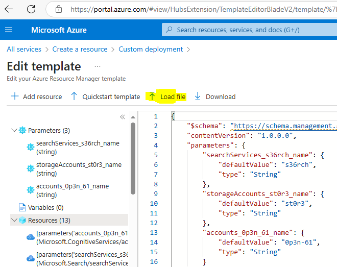
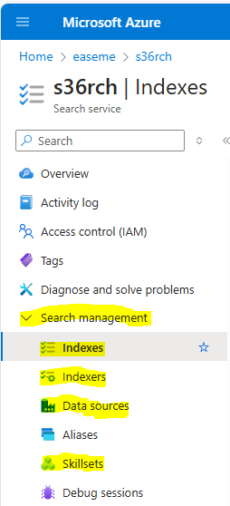
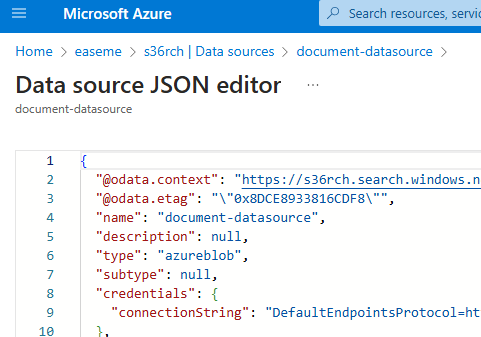
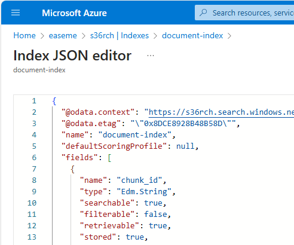
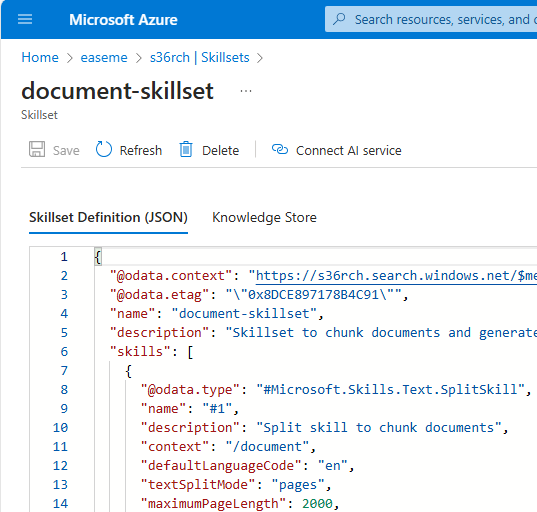
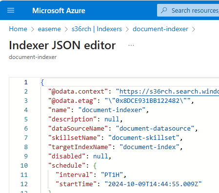
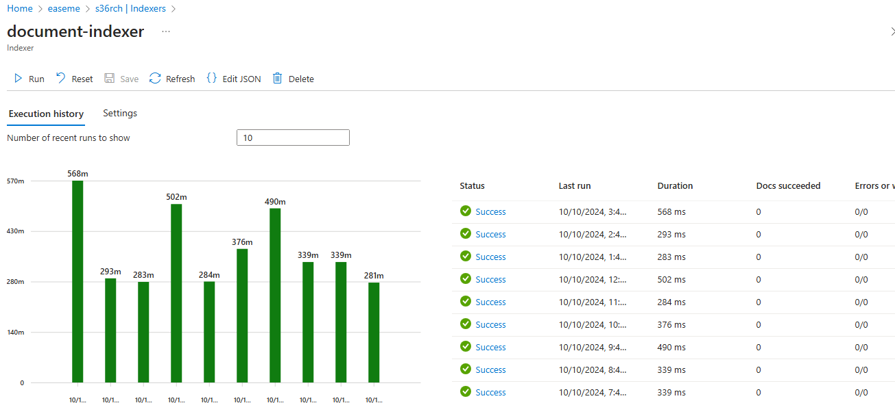
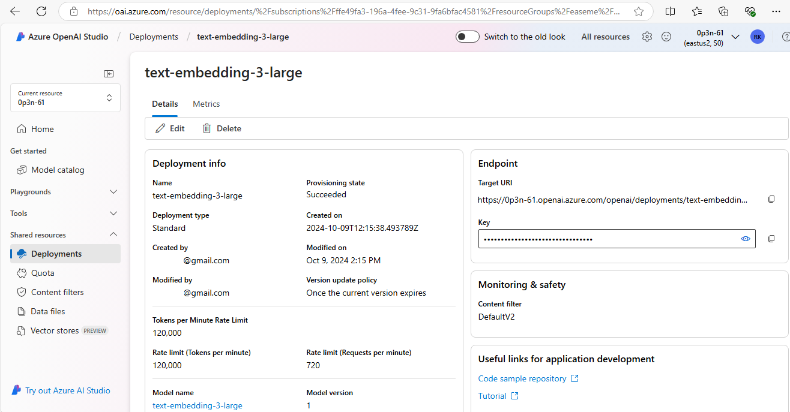
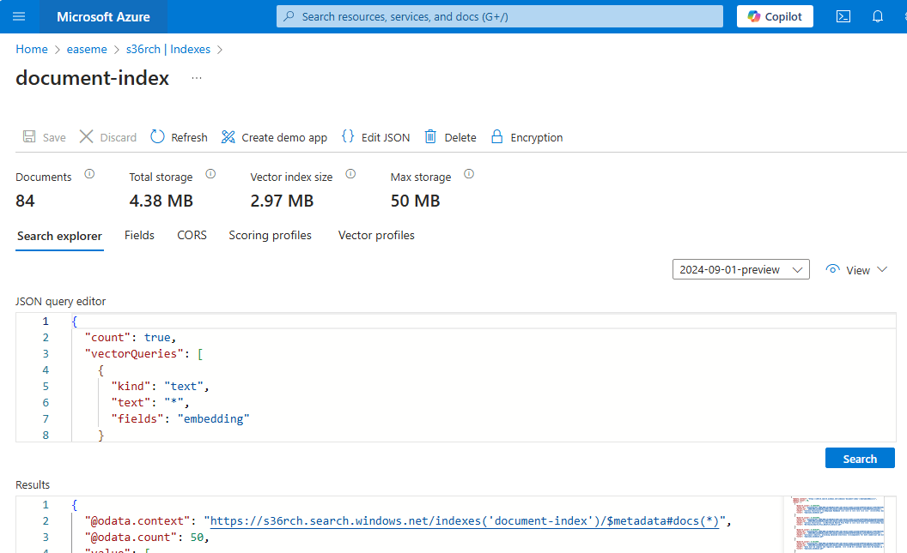

# Integrated Data Chunking and Embedding with Azure AI Search

Based on the following Microsoft resources:
- [Quickstart: Vectorize text and images by using the Azure portal](https://learn.microsoft.com/en-us/azure/search/search-get-started-portal-import-vectors?tabs=sample-data-storage%2Cmodel-aoai%2Cconnect-data-storage)
- [Integrated data chunking and embedding in Azure AI Search](https://learn.microsoft.com/en-us/azure/search/vector-search-integrated-vectorization)
- [Create a vector index](https://learn.microsoft.com/en-us/azure/search/vector-search-how-to-create-index?tabs=config-2024-07-01%2Crest-2024-07-01%2Cpush%2Cportal-check-index)

For better understanding followed through this material to get a bit of practice:
- [Implement knowledge mining with Azure AI Search](https://learn.microsoft.com/en-us/training/paths/implement-knowledge-mining-azure-cognitive-search/)

## 1. Set up the Azure resources

The .json files in the [azure_template](azure_template) folder can be used to create the required Azure resources. Just upload them on the [Edit template](https://portal.azure.com/#view/HubsExtension/TemplateEditorBladeV2/template/%7B%0A%20%20%20%20%22%24schema%22%3A%20%22https%3A%2F%2Fschema.management.azure.com%2Fschemas%2F2019-04-01%2FdeploymentTemplate.json%23%22%2C%0A%20%20%20%20%22contentVersion%22%3A%20%221.0.0.0%22%2C%0A%20%20%20%20%22parameters%22%3A%20%7B%7D%2C%0A%20%20%20%20%22resources%22%3A%20%5B%5D%0A%7D) page on the Azure portal:

The following 3 resources should be created:
- Storage account
- Search service
- Azure OpenAI

## 2. Create the index and the indexer that hourly processes the uploaded documents from the storage datasource using the predefined skillset

Use the **.json** files in the [search_management](search_management) folder for these items.

### - [Datasource - datasource.json](https://portal.azure.com/#view/Microsoft_Azure_Search/EditDataSourceJson.ReactView/dataSourceId/%2Fsubscriptions%2Fffe49fa3-196a-4fee-9c31-9fa6bfac4581%2FresourceGroups%2Feaseme%2Fproviders%2FMicrosoft.Search%2FsearchServices%2Fs36rch%23document-datasource)

### - [Index - index.json](https://portal.azure.com/#view/Microsoft_Azure_Search/IndexJsonEditor.ReactView/indexId/%2Fsubscriptions%2Fffe49fa3-196a-4fee-9c31-9fa6bfac4581%2FresourceGroups%2Feaseme%2Fproviders%2FMicrosoft.Search%2FsearchServices%2Fs36rch%23document-index)

Please update the **connectionString** with the proper value from your storage account.

### - [Skillset - skillset.json](https://portal.azure.com/#view/Microsoft_Azure_Search/SkillsBlade/resourceId/%2Fsubscriptions%2Fffe49fa3-196a-4fee-9c31-9fa6bfac4581%2FresourceGroups%2Feaseme%2Fproviders%2FMicrosoft.Search%2FsearchServices%2Fs36rch/regionId/eastus2/skillsetName/document-skillset/existingKeyDescription//existingKey/)

The index references the Azure OpenAI deployment when creates the embedding for the search text, so please make sure the **apiKey** (under *vectorizers/azureOpenAIParameters* section) has the right value according to the created deployment.

### - [Indexer - indexer.json](https://portal.azure.com/#view/Microsoft_Azure_Search/IndexerJsonEditor.ReactView/indexerId/%2Fsubscriptions%2Fffe49fa3-196a-4fee-9c31-9fa6bfac4581%2FresourceGroups%2Feaseme%2Fproviders%2FMicrosoft.Search%2FsearchServices%2Fs36rch%23document-indexer)

Again, this should be updated with the embedder **apiKey** from the Azure OpenAI deployment for the 2nd skill to work.

For the embedding an Azure OpenAI deployment is used. With the **text-embedding-3-large** model we can have 3072 dimensions:

### 3. Search the index

